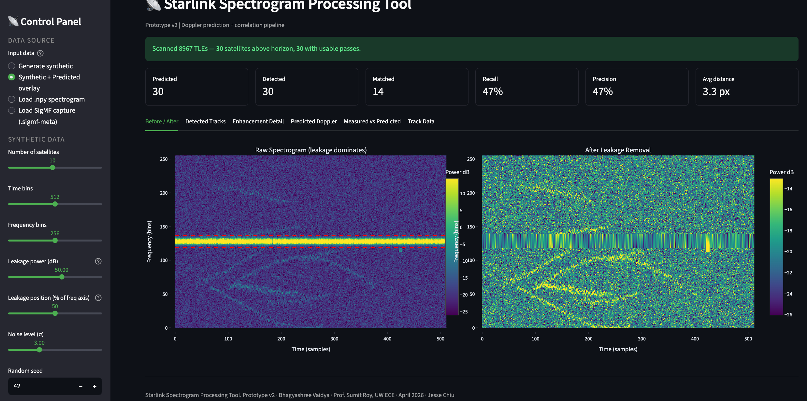

# Starlink Spectrogram Processing Tool

**Author:** Bhagyashree Vaidya
**For:** FunLab — Prof. Sumit Roy & Jesse Chiu, UW ECE
**Status:** Prototype v2 (April 2026)

An interactive Streamlit application that turns raw Starlink LEO satellite
captures into clean Doppler S-curves, detects each satellite track, and
correlates the detections against TLE-based orbital predictions.

---

## Screenshots

**Before / After — leakage removal**


**Detected Tracks**


**Predicted Doppler (TLE-based, Skyfield)**


**Measured vs Predicted — correlation overlay**


---

## 1. What problem does it solve?

The FunLab receiver at Sieg Hall captures wide-band RF data while Starlink
satellites pass overhead. When you plot the resulting time-frequency
spectrograms, three problems make the data hard to use:

1. **A bright signal-leakage band** dominates the display and visually drowns
   out everything else.
2. **Real satellite tracks are faint** — they look like thin curved smudges
   sitting just above the noise floor.
3. **There is no easy way to check predictions against measurements.** Jesse's
   `doppler-predictor` can compute *where* a satellite *should* appear in the
   spectrogram, but until now there was no GUI that overlays the prediction on
   top of the measured data and tells you which detected track corresponds to
   which TLE.

This tool solves all three in a single interactive pipeline:

- removes the leakage band,
- detects every faint Doppler S-curve in the cleaned spectrogram,
- generates the predicted S-curves from TLE data using the same math as
  Jesse's predictor,
- correlates the two and reports recall, precision, and per-track confidence.

The aim is to give the FunLab group a fast, repeatable way to validate
captures, compare nights, and debug the receiver setup without writing new
code each time.

---

## 2. How does it work?

The app runs four pipeline stages, each visible as a tab in the GUI.

```
  ┌─────────────┐    ┌─────────────┐    ┌─────────────┐    ┌──────────────┐
  │ 1. LOAD     │ -> │ 2. CLEAN    │ -> │ 3. DETECT   │ -> │ 4. CORRELATE │
  │ spectrogram │    │ leakage     │    │ tracks      │    │ vs predicted │
  └─────────────┘    └─────────────┘    └─────────────┘    └──────────────┘
```

### Stage 1 — Load

Four input modes are supported:

| Mode | Source | Use case |
|---|---|---|
| Generate synthetic | Built-in generator | Standalone demo, no data needed |
| Synthetic + Predicted overlay | Generator + predicted curves | Drives the correlation pipeline end-to-end |
| Load `.npy` spectrogram | Pre-computed array | A spectrogram you saved earlier |
| Load SigMF capture | `.sigmf-meta` + `.sigmf-data` | Raw IQ from the FunLab capture rig |

For SigMF the tool memory-maps the IQ file, runs an STFT
(`NFFT=1024`, `noverlap=512`), shifts DC to centre, and notches the central
40 bins — matching the settings in the FunLab `plot_sigmf3.py` /
`correlation_preprocessing.py` scripts.

### Stage 2 — Leakage removal

The bright leakage band stands out because its **mean power along time** is
much higher than any satellite track (which only appears for a few seconds).
The cleaner therefore:

1. Computes mean power per frequency bin.
2. Flags bins above the user-chosen percentile (default P95) as leakage.
3. Dilates the mask a few pixels to catch sidelobes.
4. Fills the masked rows with linear interpolation (or median / zero, user
   choice).

The result is a spectrogram with the leakage stripe replaced by an estimate
of the underlying noise + faint signal.

### Stage 3 — Track detection

After cleaning, the actual Doppler tracks are still faint, so the detector:

1. Subtracts a local background (median filter, kernel ~15 px).
2. Smooths gently with a Gaussian (σ ≈ 1.5).
3. Thresholds at `mean + k·σ` of the enhanced image.
4. Removes connected components shorter than `min_track_length`.
5. Labels each remaining blob and extracts shape statistics (length, width,
   eccentricity, orientation, mean/max power, bounding box).

Each surviving blob is a candidate satellite track.

### Stage 4 — Correlation against predictions

This is the new piece, and it is what ties the receiver data back to the
orbital model.

**Prediction generation.** The `doppler_predictor` module is a
Streamlit-friendly extraction of the prediction class from Jesse's
`doppler-predictor` GUI. It uses Skyfield's SGP4 propagator to compute, for
each TLE entry:

- the satellite position relative to the ground station,
- its slant range at *t* and *t + 1 s*,
- the range rate by finite difference,
- the Doppler shift from
  `f_doppler = -f_tx · v_radial / c`  (with `f_tx = 10.5 GHz`).

A whole pass becomes a 1-D curve in time-frequency space — the classic
S-curve where the satellite first approaches (negative Doppler), passes
overhead (zero crossing), and recedes (positive Doppler).

> For fast demos the prototype also ships a synthetic prediction generator
> that produces curves with the same statistical shape, so the tool can be
> exercised without having to run a 9 000-satellite Skyfield scan.

**Matching.** The `correlation` module compares each detected track against
each predicted curve:

1. For every prediction, compute the mean per-pixel distance between the
   predicted curve and the detected track at the time bins they share.
2. Sort all (detection, prediction) pairs by distance.
3. Greedy 1-to-1 assignment with a `max_distance_px` cutoff (default 12 px).
4. Score each match with a confidence `exp(-distance / 4)`.

The output tells you:

- which detected tracks match which TLE,
- which predictions were missed by the receiver,
- which detections are unmatched (likely RFI / false alarms),
- aggregate **recall** and **precision**.

---

## 3. What you see in the GUI

The Streamlit app exposes everything as configurable sliders and tabs.

**Sidebar (control panel)**

- *Data Source* — pick one of the four input modes.
- *Synthetic Data* — array shape, leakage power & position, noise σ, seed.
- *Doppler Prediction* — number of predicted satellites, miss rate, false
  alarms (synthetic only), max match distance.
- *Leakage Removal* — detection percentile, mask dilation, fill method.
- *Track Detection* — smoothing σ, threshold multiplier, minimum length,
  background filter size.
- *Display* — colourscale, ground-truth overlay toggle.

**Metric bar (top of main panel)** — when correlation is on:

```
Predicted | Detected | Matched | Recall | Precision | Avg distance
```

**Tabs**

| Tab | Shows |
|---|---|
| Before / After | Raw vs cleaned spectrogram, leakage band marked in red |
| Detected Tracks | Cleaned spectrogram with each detected track coloured and labelled |
| Enhancement Detail | Enhanced (background-subtracted) image, mean-power-per-frequency plot, individual track close-ups |
| **Predicted Doppler** | Predicted S-curves in time/frequency space + radial velocity vs time |
| **Measured vs Predicted** | Detected pixels coloured by their best-match satellite, predicted curves overlaid (solid = matched, dotted = missed), full match table, JSON export |
| Track Data | Numerical table for every detected track + JSON / `.npy` export |

---

## 4. Project layout

```
Streamlit Interactive UI/
├── app.py                       # Streamlit GUI (top-to-bottom pipeline + tabs)
├── files/
│   ├── starlink_pipeline.py     # Synthetic generator, leakage removal, detection
│   ├── doppler_predictor.py     # Skyfield TLE → Doppler curve (from Jesse's repo)
│   ├── capture_loader.py        # SigMF / .npy / CSV loaders + STFT
│   └── correlation.py           # Detection ↔ prediction matcher
├── doppler-predictor/           # Jesse's upstream repo (cloned for TLE + reference)
├── requirements.txt
├── Dockerfile
├── .streamlit/config.toml       # Dark theme
└── README.md                    # This file
```

### Key modules at a glance

**`files/starlink_pipeline.py`** — pure NumPy/SciPy/scikit-image pipeline.
Provides `generate_synthetic_spectrogram`, `remove_leakage`, `detect_tracks`,
and a CLI runner. Used by the GUI and runnable as a standalone script.

**`files/doppler_predictor.py`** — adapted from Jesse Chiu's
`doppler-predictor` GUI. Exposes `DopplerPredictor` (single satellite,
TLE-based, Skyfield-backed) and `compute_pass()` /  `build_waterfall()` to
turn an orbit into a velocity-domain waterfall the same way the upstream GUI
does. `generate_synthetic_prediction()` is a fast demo path that returns
curves with the same shape but no Skyfield dependency.

**`files/capture_loader.py`** — input adapters. `load_sigmf` mmaps a complex64
IQ file and returns it with metadata; `iq_to_spectrogram` runs the same STFT
+ DC notch as `plot_sigmf3.py`; `synthetic_measured_capture` paints predicted
curves into a noisy spectrogram with leakage / jitter / misses / false alarms
so the rest of the pipeline can be exercised without real data.

**`files/correlation.py`** — `match_tracks_to_predictions` is the main entry
point. It builds an all-pairs distance table, greedy-matches in increasing
distance, and returns matches + unmatched lists + a recall/precision summary.
`image_correlation_score` is an alternate scorer that slides a rasterised
prediction mask across the enhanced spectrogram for those who prefer 2-D
cross-correlation.

---

## 5. Running it

```bash
# 1) one-time setup
cd "Streamlit Interactive UI"
python3 -m venv venv
source venv/bin/activate
pip install -r requirements.txt

# 2) launch
streamlit run app.py
# → http://localhost:8501
```

Docker (optional):

```bash
docker build -t starlink-spectrogram .
docker run -p 8501:8501 starlink-spectrogram
```

### Working with real captures

1. Download a `starlink_sigmf_*` folder from the FunLab Drive.
2. Make sure each `.sigmf-meta` has its matching `.sigmf-data` next to it.
3. In the sidebar choose **Load SigMF capture** and paste the path to the
   `.sigmf-meta` file.
4. Adjust the leakage / detection sliders if needed — the defaults match the
   `plot_sigmf3.py` / `correlation_preprocessing.py` settings.

### Working with TLE-based predictions

`doppler-predictor/starlink.txt` ships ~9 000 Starlink TLEs. To use them in
code:

```python
from files.doppler_predictor import load_tle_file, DopplerPredictor
from datetime import datetime

entries = load_tle_file("doppler-predictor/starlink.txt")
name, l1, l2 = entries[0]
dp = DopplerPredictor(l1, l2, sat_name=name)
pass_data = dp.compute_pass(datetime.utcnow(), duration_s=600, step_s=1.0,
                            elevation_mask=10.0)
```

The current GUI uses `generate_synthetic_prediction()` by default so the demo
runs instantly; promoting Skyfield to the default sidebar option is a small
change once we settle on the time / location to demo against.

---

## 6. Theory cheat-sheet

**Doppler shift**

```
f_doppler = -f_tx · v_radial / c
v_radial  = d(slant_range) / dt   (finite difference, 1 s step)
```

**Free-space path loss** (used to colour the predicted waterfall)

```
FSPL_dB = 20·log10(d) + 20·log10(f) + 20·log10(4π/c)
```

**Why Doppler tracks look like S-curves.** As a LEO passes overhead, the
component of its velocity along the line of sight goes from `-7 km/s`
(approach) through `0` (closest approach) to `+7 km/s` (recession). Plotted
against time at a fixed transmit frequency, the received frequency traces a
smooth S — the same shape every Starlink pass produces.

---

## 7. Credits

- **Doppler prediction logic** is adapted from
  [`jessest94106/doppler-predictor`](https://github.com/jessest94106/doppler-predictor)
  (Jesse Chiu, UW ECE). The TLE file `starlink.txt` is shipped from the same
  repo.
- **SigMF / capture-side processing** mirrors the FunLab capture pipeline
  (`plot_sigmf3.py`, `plot_sigmf4.py`, `correlation_preprocessing.py` from
  the shared Drive folder).
- **Synthetic generator, leakage removal, track detector, GUI** —
  Bhagyashree Vaidya, FunLab prototype.
