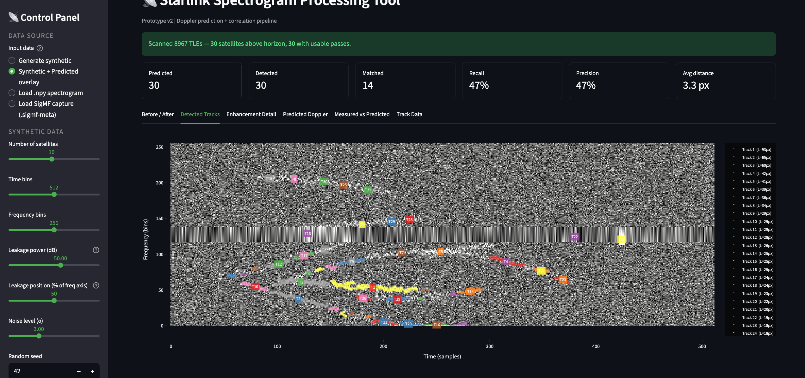
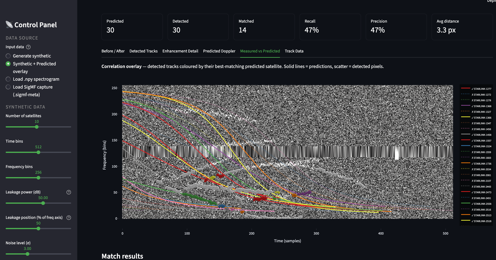

# Starlink Spectrogram Processing Tool

**Built by:** Bhagyashree Vaidya (MS student, UW ECE)
**Lab:** Prof. Sumit Roy, FunLab
**Doppler predictor:** adapted from Jesse Chiu's [doppler-predictor](https://github.com/jessest94106/doppler-predictor)
**Status:** Prototype v2 (April 2026)

A Streamlit app that takes a raw Starlink satellite capture, cleans it up, finds the satellite tracks, and checks them against TLE-based Doppler predictions.

---

## Screenshots

**Detected Tracks**


**Predicted Doppler (TLE-based, Skyfield)**


**Measured vs Predicted**


---

## What it does

The FunLab receiver captures wide-band RF data as Starlink satellites pass overhead. The raw spectrograms have two problems: a bright signal-leakage band that drowns out everything else, and faint satellite tracks that are hard to see. There was also no easy way to check whether a detected track actually matches a predicted satellite pass.

This tool addresses all three:

1. Removes the leakage band automatically.
2. Detects each faint Doppler S-curve in the cleaned spectrogram.
3. Compares the detections against TLE-based predictions and reports which ones matched, which were missed, and which are likely RFI.

---

## Pipeline

```
Load capture -> Remove leakage -> Detect tracks -> Correlate vs predictions
```

**Stage 1: Load**

Supports four input modes:

| Mode | Source |
|---|---|
| Generate synthetic | Built-in generator, no data needed |
| Synthetic + Predicted overlay | Generator + predicted curves, runs the full pipeline |
| Load .npy spectrogram | A pre-computed NumPy array |
| Load SigMF capture | Raw IQ from the FunLab receiver (.sigmf-meta + .sigmf-data) |

For SigMF files, the app memory-maps the IQ data, runs an STFT (NFFT=1024, noverlap=512), shifts DC to centre, and notches the central 40 bins. These settings match the FunLab `plot_sigmf3.py` and `correlation_preprocessing.py` scripts.

**Stage 2: Leakage removal**

1. Computes mean power per frequency bin.
2. Flags bins above a percentile threshold (default P95) as leakage.
3. Dilates the mask a few pixels to catch sidelobes.
4. Fills the masked rows with linear interpolation.

**Stage 3: Track detection**

1. Subtracts a local background (median filter).
2. Smooths with a Gaussian.
3. Thresholds at mean + k * sigma of the enhanced image.
4. Removes short connected components.
5. Labels each remaining blob and extracts shape stats.

**Stage 4: Correlation**

The Doppler prediction logic is adapted from Jesse Chiu's `doppler-predictor`. It uses Skyfield's SGP4 propagator to compute the range rate for each TLE and convert it to a Doppler shift:

```
f_doppler = -f_tx * v_radial / c
v_radial = d(slant_range) / dt  (finite difference, 1 s step)
```

The correlation module then:

1. Computes the mean per-pixel distance between each detected track and each predicted curve.
2. Greedy 1-to-1 assigns detections to predictions (closest first, within a configurable distance cutoff).
3. Reports recall, precision, average distance, and per-match confidence.

A synthetic prediction generator is also included for demos that do not need a live Skyfield scan.

---

## GUI

**Sidebar**

- Data source picker
- Synthetic data settings (array shape, leakage, noise, seed)
- Doppler prediction settings (miss rate, false alarms, max match distance)
- Leakage removal settings (percentile, dilation, fill method)
- Track detection settings (threshold, minimum length, background filter)

**Metric bar (when correlation is on)**

```
Predicted | Detected | Matched | Recall | Precision | Avg distance
```

**Tabs**

| Tab | Content |
|---|---|
| Before / After | Raw vs cleaned spectrogram, leakage bins marked in red |
| Detected Tracks | Cleaned spectrogram with each track labelled |
| Enhancement Detail | Background-subtracted image and mean power plot |
| Predicted Doppler | Predicted S-curves and radial velocity over time |
| Measured vs Predicted | Correlation overlay, match table, JSON export |
| Track Data | Shape stats for every detected track, JSON and .npy export |

---

## Project layout

```
Streamlit Interactive UI/
├── app.py                    # Streamlit app
├── files/
│   ├── starlink_pipeline.py  # Leakage removal and track detection
│   ├── doppler_predictor.py  # Doppler prediction (adapted from Jesse's repo)
│   ├── capture_loader.py     # SigMF and .npy loaders
│   └── correlation.py        # Track-to-prediction matcher
├── doppler-predictor/        # Jesse's repo, added as a git submodule
├── screenshots/
├── sample_data/
├── requirements.txt
├── Dockerfile
└── .streamlit/config.toml
```

---

## Setup

```bash
cd "Streamlit Interactive UI"
python3 -m venv venv
source venv/bin/activate
pip install -r requirements.txt
streamlit run app.py
# opens at http://localhost:8501
```

Docker:

```bash
docker build -t starlink-spectrogram .
docker run -p 8501:8501 starlink-spectrogram
```

**Using real captures**

1. Download a `starlink_sigmf_*` folder from the FunLab Drive.
2. Make sure the `.sigmf-meta` and `.sigmf-data` files are in the same folder.
3. In the sidebar, choose Load SigMF capture and paste the path to the `.sigmf-meta` file.
4. Adjust sliders as needed. Defaults match the FunLab capture scripts.

**Using TLE predictions**

```python
from files.doppler_predictor import load_tle_file, DopplerPredictor
from datetime import datetime

entries = load_tle_file("doppler-predictor/starlink.txt")
name, l1, l2 = entries[0]
dp = DopplerPredictor(l1, l2, sat_name=name)
pass_data = dp.compute_pass(datetime.utcnow(), duration_s=600, step_s=1.0,
                            elevation_mask=10.0)
```

---

## Credits

- **Doppler prediction** is adapted from [jessest94106/doppler-predictor](https://github.com/jessest94106/doppler-predictor) by Jesse Chiu (UW ECE). The TLE file `starlink.txt` is from the same repo.
- **SigMF loading and STFT settings** follow the FunLab capture pipeline (`plot_sigmf3.py`, `correlation_preprocessing.py` from the shared Drive folder).
- **Leakage removal, track detection, correlation module, and Streamlit GUI** were built by Bhagyashree Vaidya as part of a FunLab prototype.
